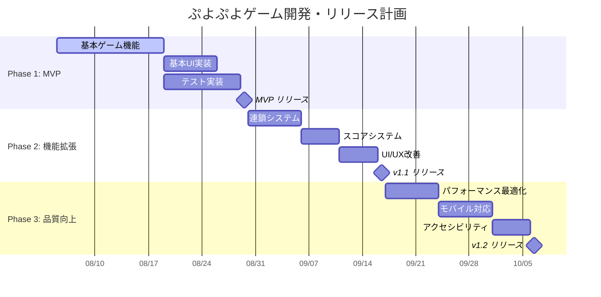
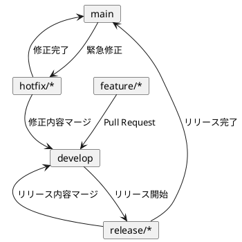
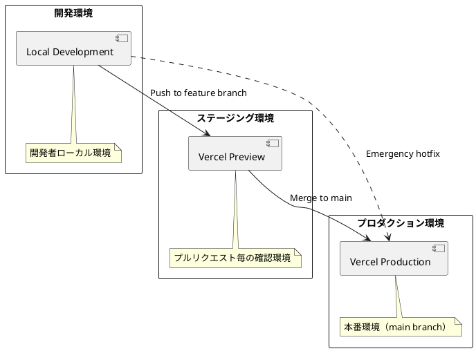
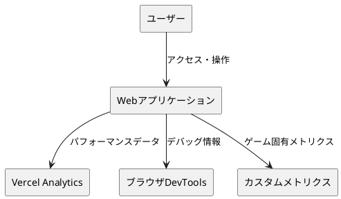
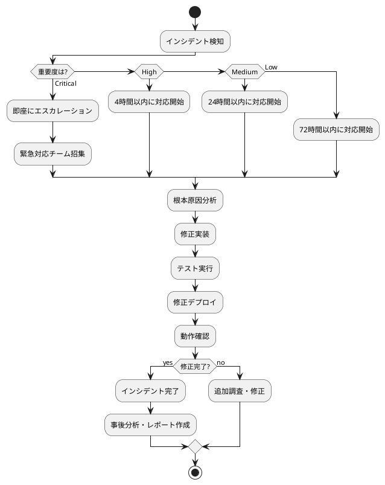
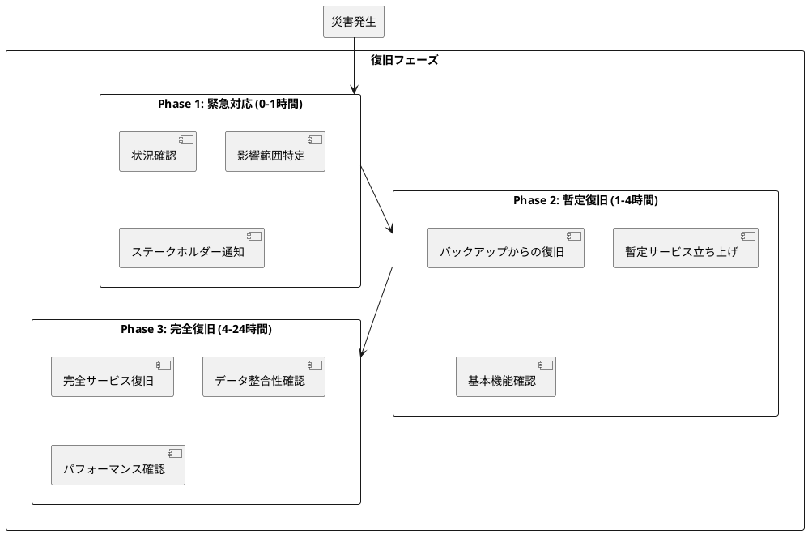

# 運用要件とリリース計画

## 概要

ぷよぷよゲームアプリケーションの運用要件を定義し、段階的なリリース計画を策定します。継続的デリバリーとアジャイル開発アプローチにより、価値の早期提供と継続的改善を実現します。

## リリース戦略

### 段階的リリース計画



### リリース戦略の詳細

| フェーズ | 目標 | 期間 | 成果物 | 成功指標 |
|----------|------|------|--------|----------|
| **MVP** | 基本ゲーム機能の提供 | 3週間 | プレイ可能なゲーム | ゲーム完了率 > 80% |
| **v1.1** | 完全なゲーム体験の提供 | 2週間 | 連鎖・スコア機能 | ユーザー滞在時間 > 5分 |
| **v1.2** | 品質とUXの向上 | 3週間 | 最適化版 | パフォーマンス指標達成 |

## 開発フロー

### ブランチ戦略



### CI/CDパイプライン

```yaml
# .github/workflows/ci-cd.yml
name: CI/CD Pipeline

on:
  push:
    branches: [ main, develop ]
  pull_request:
    branches: [ main, develop ]

jobs:
  test:
    runs-on: ubuntu-latest
    steps:
      - uses: actions/checkout@v3
      - name: Setup Node.js
        uses: actions/setup-node@v3
        with:
          node-version: '18'
          cache: 'npm'
      
      - name: Install dependencies
        run: npm ci
      
      - name: Run linting
        run: npm run lint
      
      - name: Run formatting check
        run: npm run format:check
      
      - name: Run unit tests
        run: npm run test:unit
      
      - name: Run integration tests
        run: npm run test:integration
      
      - name: Build application
        run: npm run build
      
      - name: Run E2E tests
        run: npm run test:e2e

  deploy-staging:
    needs: test
    runs-on: ubuntu-latest
    if: github.ref == 'refs/heads/develop'
    steps:
      - uses: actions/checkout@v3
      - name: Deploy to Staging
        run: |
          npm run build
          # Vercel preview deployment
          npx vercel --token ${{ secrets.VERCEL_TOKEN }}

  deploy-production:
    needs: test
    runs-on: ubuntu-latest
    if: github.ref == 'refs/heads/main'
    steps:
      - uses: actions/checkout@v3
      - name: Deploy to Production
        run: |
          npm run build
          # Vercel production deployment
          npx vercel --prod --token ${{ secrets.VERCEL_TOKEN }}
```

## 環境構成

### 環境一覧



| 環境 | URL | 用途 | 更新タイミング |
|------|-----|------|----------------|
| **Local** | http://localhost:3000 | 開発・デバッグ | 開発者による手動 |
| **Staging** | https://staging-*.vercel.app | テスト・レビュー | PR作成時自動 |
| **Production** | https://puyo-game.vercel.app | 本番サービス | main branch更新時 |

### 環境設定管理

```typescript
// config/environment.ts
interface EnvironmentConfig {
  isDevelopment: boolean;
  isProduction: boolean;
  apiUrl: string;
  logLevel: 'debug' | 'info' | 'warn' | 'error';
  analytics: {
    enabled: boolean;
    trackingId?: string;
  };
}

const environments: Record<string, EnvironmentConfig> = {
  development: {
    isDevelopment: true,
    isProduction: false,
    apiUrl: 'http://localhost:3000',
    logLevel: 'debug',
    analytics: { enabled: false }
  },
  
  staging: {
    isDevelopment: false,
    isProduction: false,
    apiUrl: 'https://staging-api.vercel.app',
    logLevel: 'info',
    analytics: { enabled: false }
  },
  
  production: {
    isDevelopment: false,
    isProduction: true,
    apiUrl: 'https://api.puyo-game.com',
    logLevel: 'warn',
    analytics: { 
      enabled: true,
      trackingId: 'GA_TRACKING_ID'
    }
  }
};

export const config = environments[process.env.NODE_ENV || 'development'];
```

## 監視・観測

### メトリクス収集



### 収集メトリクス

| カテゴリ | メトリクス | 収集方法 | 閾値 |
|----------|------------|----------|------|
| **パフォーマンス** | FPS, レスポンス時間 | Performance API | FPS > 55 |
| **ユーザー行動** | プレイ時間, 操作回数 | カスタムイベント | プレイ時間 > 2分 |
| **エラー** | JavaScript エラー | window.onerror | エラー率 < 1% |
| **ネットワーク** | 読み込み時間 | Navigation Timing | 読み込み < 3秒 |

### 監視実装例

```typescript
// monitoring/analytics.ts
class GameAnalytics {
  private static instance: GameAnalytics;
  private events: GameEvent[] = [];

  static getInstance(): GameAnalytics {
    if (!this.instance) {
      this.instance = new GameAnalytics();
    }
    return this.instance;
  }

  trackGameStart(): void {
    this.trackEvent('game_start', {
      timestamp: Date.now(),
      userAgent: navigator.userAgent,
      viewport: `${window.innerWidth}x${window.innerHeight}`
    });
  }

  trackGameEnd(score: number, duration: number): void {
    this.trackEvent('game_end', {
      score,
      duration,
      timestamp: Date.now()
    });
  }

  trackChain(chainCount: number, score: number): void {
    this.trackEvent('chain_occurred', {
      chainCount,
      score,
      timestamp: Date.now()
    });
  }

  trackPerformance(fps: number, frameTime: number): void {
    if (fps < 50) { // パフォーマンス問題の検出
      this.trackEvent('performance_issue', {
        fps,
        frameTime,
        timestamp: Date.now()
      });
    }
  }

  private trackEvent(eventName: string, data: any): void {
    const event: GameEvent = {
      name: eventName,
      data,
      sessionId: this.getSessionId(),
      timestamp: Date.now()
    };

    this.events.push(event);
    
    // プロダクション環境でのみ外部送信
    if (config.isProduction && config.analytics.enabled) {
      this.sendToAnalytics(event);
    }
  }

  private sendToAnalytics(event: GameEvent): void {
    // Google Analytics 4 or other analytics service
    if (typeof gtag !== 'undefined') {
      gtag('event', event.name, event.data);
    }
  }

  private getSessionId(): string {
    let sessionId = sessionStorage.getItem('gameSessionId');
    if (!sessionId) {
      sessionId = Math.random().toString(36).substring(2);
      sessionStorage.setItem('gameSessionId', sessionId);
    }
    return sessionId;
  }
}
```

## デプロイメント手順

### 自動デプロイメント

1. **コード変更**: 開発者がfeatureブランチにプッシュ
2. **CI実行**: GitHub Actionsが自動実行
3. **テスト**: 全テストスイートが実行
4. **ビルド**: プロダクションビルドが生成
5. **デプロイ**: Vercelが自動デプロイ
6. **検証**: E2Eテストで動作確認

### 手動デプロイメント（緊急時）

```bash
# 緊急デプロイメント手順
# 1. 緊急修正ブランチ作成
git checkout main
git checkout -b hotfix/critical-fix

# 2. 修正作業
# ... コード修正 ...

# 3. テスト実行
npm run test:all
npm run build

# 4. 本番デプロイ
git add .
git commit -m "hotfix: critical bug fix"
git push origin hotfix/critical-fix

# 5. プルリクエスト作成・マージ
gh pr create --title "Critical Fix" --body "緊急修正"
# レビュー後マージ

# 6. デプロイ確認
curl -I https://puyo-game.vercel.app
```

## 運用手順書

### 日次運用タスク

| 時間 | タスク | 担当 | 確認項目 |
|------|--------|------|----------|
| 09:00 | システム状況確認 | 運用者 | 稼働状況、エラーログ |
| 12:00 | パフォーマンス確認 | 運用者 | 応答時間、リソース使用量 |
| 18:00 | 日次レポート作成 | 運用者 | KPI、インシデント記録 |

### 週次運用タスク

| 曜日 | タスク | 内容 |
|------|--------|------|
| 月曜日 | 週次計画確認 | リリース計画、タスク優先度 |
| 水曜日 | セキュリティチェック | 依存関係更新、脆弱性確認 |
| 金曜日 | 週次レポート | パフォーマンス、ユーザーフィードバック |

### インシデント対応手順



## バックアップ・復旧

### データバックアップ戦略

| データ種別 | バックアップ頻度 | 保存期間 | 復旧目標時間 |
|------------|------------------|----------|--------------|
| **ソースコード** | リアルタイム（Git） | 永続 | 5分 |
| **設定ファイル** | 変更時 | 1年間 | 10分 |
| **ユーザーデータ** | N/A（ローカル保存） | N/A | N/A |
| **ログデータ** | 日次 | 3ヶ月 | 30分 |

### 災害復旧計画



## リリース後の運用計画

### フィードバック収集

1. **ユーザーフィードバック**
   - GitHub Issues
   - ユーザーレビュー
   - ソーシャルメディア

2. **技術メトリクス**
   - パフォーマンス監視
   - エラーレート監視
   - 使用パターン分析

3. **継続的改善**
   - 月次レトロスペクティブ
   - 機能優先度の見直し
   - 技術的負債の解消

### 長期運用ロードマップ

| 期間 | 目標 | 主要活動 |
|------|------|----------|
| **第1四半期** | 安定運用確立 | 監視体制構築、バグ修正 |
| **第2四半期** | 機能拡張 | 新機能追加、UI/UX改善 |
| **第3四半期** | パフォーマンス向上 | 最適化、スケーラビリティ向上 |
| **第4四半期** | 次期バージョン準備 | 大規模機能追加、アーキテクチャ改善 |

この運用要件とリリース計画により、段階的で安定したサービス提供と継続的な価値向上を実現します。