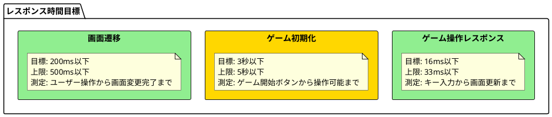
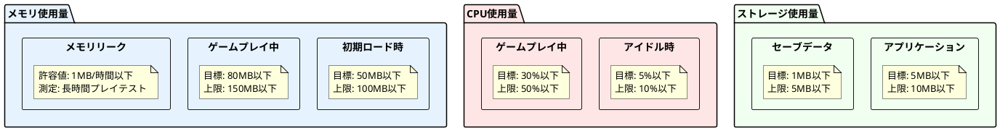
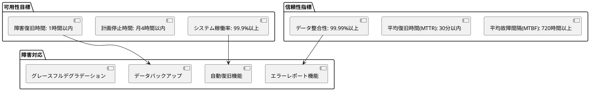
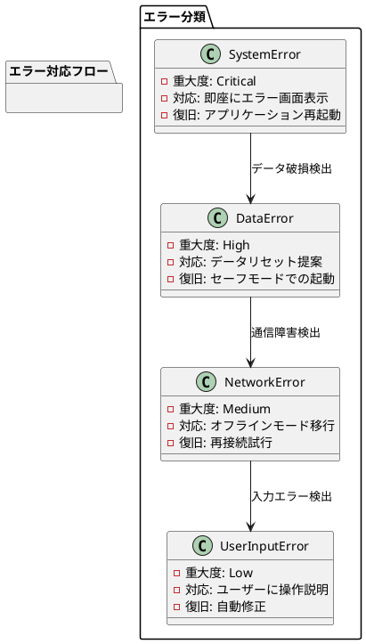
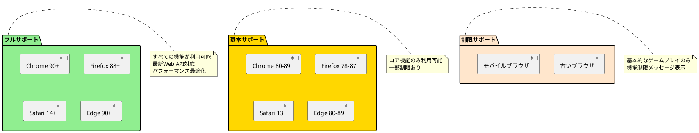
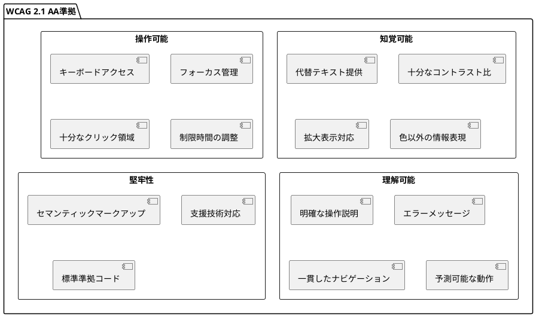
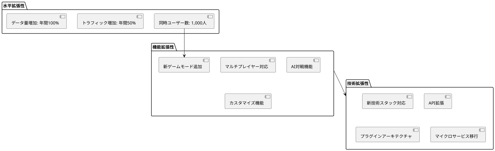
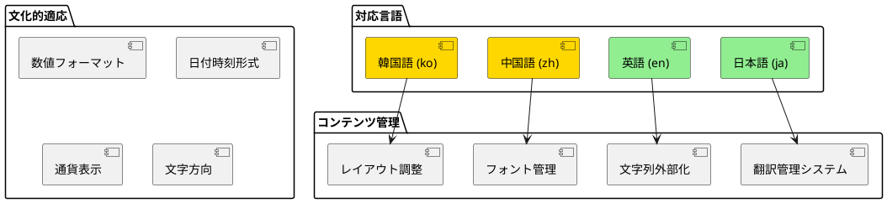
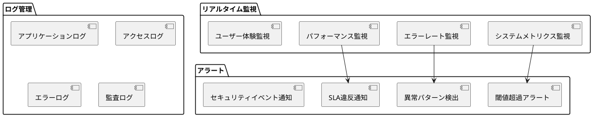
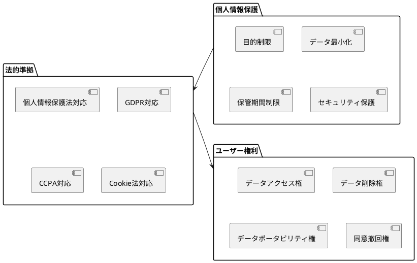

# 非機能要件

## 概要

ぷよぷよゲームシステムの非機能要件について説明します。システムの品質特性と制約事項を定義し、測定可能な指標で要件を明確化します。

## パフォーマンス要件

### レスポンス時間要件



### スループット要件

| 操作種別 | 目標値 | 測定方法 |
|----------|--------|----------|
| フレームレート | 60 FPS以上 | requestAnimationFrame監視 |
| 連鎖計算処理 | 100連鎖/秒以上 | ベンチマークテスト |
| 同時操作処理 | 10操作/秒以上 | 入力バッファリングテスト |

### リソース使用量要件



## 可用性・信頼性要件

### システム可用性



### エラーハンドリング要件



## セキュリティ要件

### 脅威モデル

```plantuml
@startuml "脅威モデル"
package "脅威と対策" {
  rectangle "XSS攻撃" {
    note as xss
      脅威: スクリプト注入
      影響: ユーザーデータ漏洩
      対策: 入力値サニタイゼーション
      優先度: 高
    end note
  }
  
  rectangle "データ改ざん" {
    note as data
      脅威: ローカルストレージ操作
      影響: スコア改ざん
      対策: データ整合性チェック
      優先度: 中
  }
  
  rectangle "DoS攻撃" {
    note as dos
      脅威: 大量リクエスト
      影響: サービス停止
      対策: レート制限
      優先度: 低
  }
}

@enduml
```

### セキュリティ制御

| セキュリティ要件 | 実装方針 | 検証方法 |
|------------------|----------|----------|
| 入力値検証 | すべての入力をサニタイズ | セキュリティテスト |
| データ暗号化 | 重要データの暗号化保存 | データ保護監査 |
| セッション管理 | セッション固定化対策 | セッションテスト |
| HTTPS通信 | すべての通信をHTTPS化 | SSL証明書監視 |

## 互換性要件

### ブラウザ互換性



### デバイス互換性

| デバイス種別 | 画面サイズ | 操作方法 | サポートレベル |
|--------------|------------|----------|----------------|
| デスクトップ | 1024px+ | キーボード・マウス | フル |
| タブレット | 768-1023px | タッチ・キーボード | フル |
| スマートフォン | 320-767px | タッチのみ | 基本 |
| 小画面デバイス | <320px | タッチのみ | 制限 |

## アクセシビリティ要件

### WCAG 2.1 準拠レベル



### 支援技術対応

| 支援技術 | 対応レベル | 実装方針 |
|----------|------------|----------|
| スクリーンリーダー | フル対応 | ARIA属性・ライブリージョン |
| 音声認識 | 基本対応 | 音声コマンド対応 |
| 拡大ソフト | フル対応 | 高コントラスト・拡大表示 |
| 代替入力デバイス | 基本対応 | カスタムキー設定 |

## 拡張性・保守性要件

### システム拡張性



### コード品質要件

| 品質指標 | 目標値 | 測定方法 |
|----------|--------|----------|
| テストカバレッジ | 80%以上 | Jest Coverage |
| 循環的複雑度 | 10以下/関数 | ESLint complexity |
| 技術的負債比率 | 5%以下 | SonarQube |
| コード重複率 | 3%以下 | 静的解析ツール |

## 国際化・ローカライゼーション要件

### 多言語対応



### 地域化対応

| 地域 | 文字エンコーディング | 入力方式 | 特別考慮事項 |
|------|----------------------|----------|--------------|
| 日本 | UTF-8 | IME対応 | 縦書き対応検討 |
| 北米 | UTF-8 | 標準キーボード | - |
| 中国 | UTF-8 | 簡体字入力 | フォントサイズ調整 |
| 韓国 | UTF-8 | ハングル入力 | 文字幅考慮 |

## 運用・監視要件

### 監視要件



### バックアップ・復旧要件

| データ種別 | バックアップ頻度 | 保管期間 | 復旧目標時間 |
|------------|------------------|----------|--------------|
| ユーザーデータ | リアルタイム | 30日 | 1時間 |
| アプリケーション設定 | 日次 | 90日 | 30分 |
| ログデータ | 週次 | 1年 | 24時間 |
| 監査ログ | 月次 | 7年 | 48時間 |

## 法的・コンプライアンス要件

### プライバシー・データ保護



### コンプライアンス要件

| 規制・標準 | 適用範囲 | 対応レベル | 監査頻度 |
|------------|----------|------------|----------|
| 個人情報保護法 | 全システム | 完全準拠 | 年次 |
| JIS X 8341 | UI/UX | レベルAA | 半年 |
| ISO 27001 | セキュリティ | 部分準拠 | 年次 |
| PCI DSS | 決済処理 | 対象外 | - |

## 非機能要件の測定・検証

### パフォーマンステスト

```plantuml
@startuml "パフォーマンステスト計画"
start

:テスト環境構築;

parallel
  :負荷テスト実行;
  note right: 通常負荷での性能測定
and
  :ストレステスト実行;
  note right: 限界負荷での動作確認
and
  :スパイクテスト実行;
  note right: 急激な負荷変動への対応
end parallel

:結果分析;

if (要件満足?) then (yes)
  :テスト合格;
else (no)
  :パフォーマンス改善;
endif

stop
@enduml
```

### 継続的監視

| 指標 | 測定頻度 | アラート閾値 | 対応手順 |
|------|----------|--------------|----------|
| レスポンス時間 | 1分間隔 | 平均50ms超過 | 自動スケーリング |
| エラー率 | 1分間隔 | 1%超過 | 開発チーム通知 |
| メモリ使用量 | 5分間隔 | 80%超過 | リソース監視強化 |
| CPU使用率 | 1分間隔 | 70%超過 | パフォーマンス調査 |

## まとめ

この非機能要件により以下を実現：

1. **パフォーマンス:** 60FPS以上の快適なゲーム体験
2. **可用性:** 99.9%以上のシステム稼働率
3. **セキュリティ:** 多層防御によるセキュリティ保護
4. **互換性:** 幅広いブラウザ・デバイスサポート
5. **アクセシビリティ:** WCAG 2.1 AA準拠のバリアフリー
6. **拡張性:** 将来の機能追加・技術変更への対応力
7. **運用性:** 効率的な監視・保守・運用体制
8. **コンプライアンス:** 法的要件・業界標準への準拠