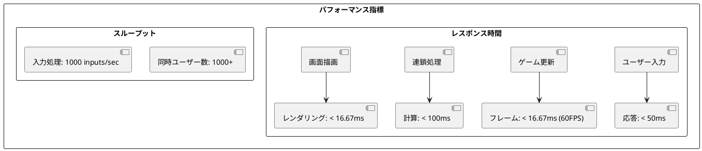
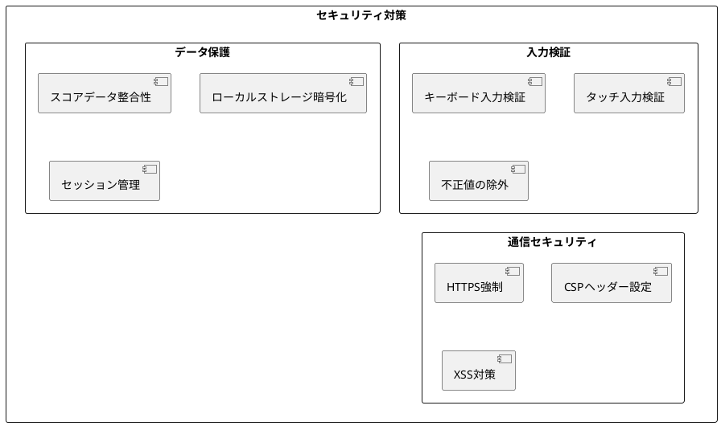
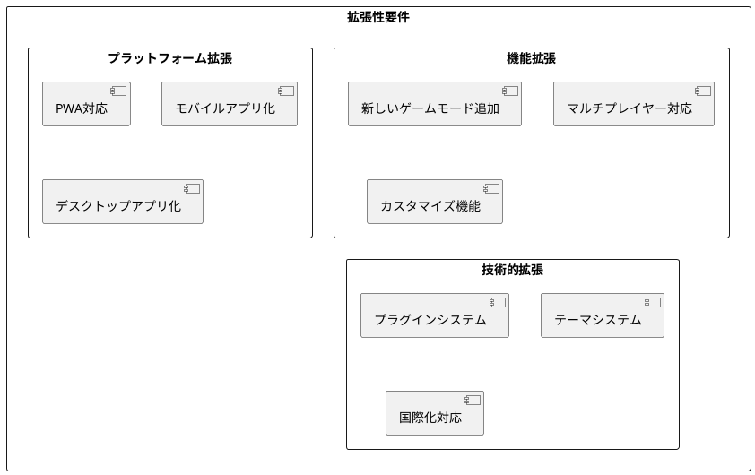
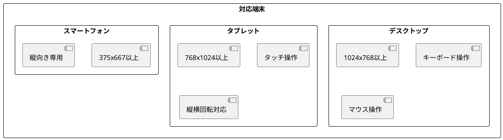
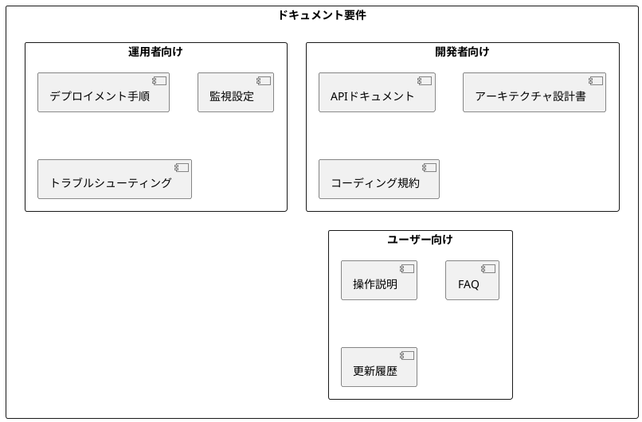

# 非機能要件

## 概要

ぷよぷよゲームアプリケーションの非機能要件を定義し、品質特性と制約事項を明確にします。これらの要件はユーザー体験の向上とシステムの安定性確保のために重要です。

## パフォーマンス要件

### レスポンス時間



| 項目 | 要件 | 測定方法 |
|------|------|----------|
| **ユーザー入力応答** | 50ms未満 | キー押下からゲーム状態変更まで |
| **フレームレート** | 60FPS（16.67ms/frame） | requestAnimationFrame計測 |
| **連鎖処理時間** | 100ms未満 | 10連鎖処理完了まで |
| **初期読み込み** | 3秒未満 | ページロードから操作可能まで |
| **メモリ使用量** | 50MB未満 | ブラウザメモリ使用量 |

### パフォーマンス測定コード例

```typescript
// パフォーマンス監視クラス
class PerformanceMonitor {
  private frameStartTime: number = 0;
  private frameCount: number = 0;
  private fpsHistory: number[] = [];

  startFrame(): void {
    this.frameStartTime = performance.now();
  }

  endFrame(): void {
    const frameTime = performance.now() - this.frameStartTime;
    const fps = 1000 / frameTime;
    
    this.fpsHistory.push(fps);
    if (this.fpsHistory.length > 60) {
      this.fpsHistory.shift();
    }
    
    this.frameCount++;
  }

  getAverageFPS(): number {
    return this.fpsHistory.reduce((a, b) => a + b, 0) / this.fpsHistory.length;
  }

  getMinFPS(): number {
    return Math.min(...this.fpsHistory);
  }
}
```

## セキュリティ要件

### データ保護



| セキュリティ項目 | 要件 | 実装方法 |
|------------------|------|----------|
| **入力検証** | すべてのユーザー入力を検証 | TypeScriptの型チェック + 実行時検証 |
| **データ整合性** | スコアデータの改ざん防止 | チェックサム検証 |
| **HTTPS通信** | すべての通信でHTTPS使用 | Vercelの自動HTTPS |
| **XSS対策** | スクリプト注入攻撃の防止 | innerHTML禁止、textContent使用 |
| **CSP設定** | Content Security Policy適用 | HTTPヘッダーでスクリプト制限 |

### セキュリティ実装例

```typescript
// 入力検証
class InputValidator {
  static validateKeyInput(key: string): boolean {
    const validKeys = ['ArrowLeft', 'ArrowRight', 'ArrowUp', 'ArrowDown', 'KeyR'];
    return validKeys.includes(key);
  }

  static validatePosition(x: number, y: number): boolean {
    return Number.isInteger(x) && Number.isInteger(y) && 
           x >= 0 && x < 6 && y >= 0 && y < 13;
  }

  static validateScore(score: number): boolean {
    return Number.isInteger(score) && score >= 0 && score <= 1000000;
  }
}

// データ整合性チェック
class DataIntegrityChecker {
  static generateChecksum(data: any): string {
    const jsonString = JSON.stringify(data);
    return btoa(jsonString).slice(0, 8); // 簡易チェックサム
  }

  static verifyChecksum(data: any, checksum: string): boolean {
    return this.generateChecksum(data) === checksum;
  }
}
```

## 可用性要件

### システム稼働率

| 項目 | 要件 | 対策 |
|------|------|------|
| **稼働率** | 99.9%以上 | CDN配信、冗長化 |
| **復旧時間** | 5分以内 | 自動復旧、監視システム |
| **メンテナンス** | 計画メンテナンス月1回以下 | ローリングアップデート |

### エラーハンドリング

```typescript
// エラーハンドリング戦略
class GameErrorHandler {
  static handleError(error: Error): void {
    // ログ記録
    console.error('Game Error:', error);
    
    // ユーザーフレンドリーメッセージ
    if (error instanceof GameOverError) {
      this.showGameOverMessage();
    } else if (error instanceof InvalidMoveError) {
      // 無視（エラー表示なし）
    } else {
      this.showGenericErrorMessage();
    }
    
    // エラー報告（本番環境のみ）
    if (process.env.NODE_ENV === 'production') {
      this.reportError(error);
    }
  }

  private static showGameOverMessage(): void {
    // ゲームオーバー画面表示
  }

  private static showGenericErrorMessage(): void {
    alert('予期しないエラーが発生しました。ページを再読み込みしてください。');
  }

  private static reportError(error: Error): void {
    // エラー報告サービスに送信（例：Sentry）
  }
}
```

## 拡張性要件

### スケーラビリティ



| 拡張性項目 | 要件 | 設計考慮事項 |
|------------|------|--------------|
| **新機能追加** | プラグイン形式で機能追加可能 | インターフェース分離、依存注入 |
| **国際化** | 多言語対応準備 | 文字列外部化、locale管理 |
| **テーマ変更** | UI色彩・デザイン変更可能 | CSS変数、テーマファイル分離 |
| **API拡張** | 外部システム連携準備 | RESTful API設計 |

## 互換性要件

### ブラウザ対応

| ブラウザ | 最小バージョン | 対応状況 | テスト優先度 |
|----------|----------------|----------|--------------|
| **Chrome** | 90+ | フル対応 | 高 |
| **Firefox** | 88+ | フル対応 | 高 |
| **Safari** | 14+ | フル対応 | 中 |
| **Edge** | 90+ | フル対応 | 中 |
| **Mobile Safari** | iOS 14+ | フル対応 | 高 |
| **Chrome Mobile** | 90+ | フル対応 | 高 |

### 端末対応



## アクセシビリティ要件

### WCAG 2.1 準拠

| レベル | 要件 | 実装内容 |
|--------|------|----------|
| **A** | 基本的なアクセシビリティ | キーボードナビゲーション、代替テキスト |
| **AA** | 推奨レベル | 色覚対応、十分なコントラスト比 |

### 実装例

```typescript
// アクセシビリティ対応
class AccessibilityManager {
  static setupKeyboardNavigation(): void {
    // タブ順序の設定
    const focusableElements = document.querySelectorAll(
      'button, [tabindex]:not([tabindex="-1"])'
    );
    
    focusableElements.forEach((element, index) => {
      element.setAttribute('tabindex', (index + 1).toString());
    });
  }

  static setupScreenReaderSupport(): void {
    // ARIA属性の設定
    const gameField = document.getElementById('game-field');
    gameField?.setAttribute('role', 'application');
    gameField?.setAttribute('aria-label', 'ぷよぷよゲームフィールド');
    
    const scoreElement = document.getElementById('current-score');
    scoreElement?.setAttribute('aria-live', 'polite');
    scoreElement?.setAttribute('aria-label', '現在のスコア');
  }

  static checkColorContrast(): boolean {
    // 色覚対応色の使用確認
    const colors = {
      background: '#FFFFFF',
      text: '#333333',
      // コントラスト比4.5:1以上を確保
    };
    return true; // 実際のコントラスト比計算
  }
}
```

## メンテナンス性要件

### コード品質

| 品質指標 | 目標値 | 測定方法 |
|----------|--------|----------|
| **テストカバレッジ** | 90%以上 | Jest coverage report |
| **複雑度** | Cyclomatic complexity < 10 | ESLint complexity rule |
| **重複コード** | 5%未満 | SonarQube分析 |
| **技術的負債** | 評価A以上 | SonarQube品質ゲート |

### ドキュメント要件



## 監視・運用要件

### 監視項目

| 項目 | 閾値 | アラート条件 |
|------|------|--------------|
| **応答時間** | 1秒 | 平均応答時間 > 1秒が5分継続 |
| **エラー率** | 1% | エラー率 > 1%が1分継続 |
| **メモリ使用量** | 80% | 使用量 > 80%が10分継続 |
| **CPU使用率** | 70% | 使用率 > 70%が5分継続 |

### ログ要件

```typescript
// ログ設定
class Logger {
  static logLevel = process.env.NODE_ENV === 'production' ? 'warn' : 'debug';

  static info(message: string, data?: any): void {
    if (this.shouldLog('info')) {
      console.log(`[INFO] ${new Date().toISOString()} - ${message}`, data);
    }
  }

  static warn(message: string, data?: any): void {
    if (this.shouldLog('warn')) {
      console.warn(`[WARN] ${new Date().toISOString()} - ${message}`, data);
    }
  }

  static error(message: string, error?: Error): void {
    if (this.shouldLog('error')) {
      console.error(`[ERROR] ${new Date().toISOString()} - ${message}`, error);
    }
  }

  private static shouldLog(level: string): boolean {
    const levels = ['error', 'warn', 'info', 'debug'];
    return levels.indexOf(level) <= levels.indexOf(this.logLevel);
  }
}
```

## 制約事項

### 技術的制約

- **ブラウザ制限**: Canvas APIの制約に依存
- **ローカルストレージ**: 5-10MBの容量制限
- **シングルスレッド**: JavaScriptの単一スレッド制約
- **ネットワーク**: オフライン動作必須

### ビジネス制約

- **開発期間**: 2ヶ月以内
- **予算**: 開発・運用コスト無料
- **リソース**: 1名での開発
- **ライセンス**: オープンソース（MIT）

これらの非機能要件を満たすことで、高品質で信頼性の高いぷよぷよゲームアプリケーションを提供します。